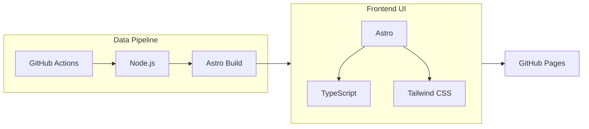

```text
   ___   _______   _______           ____            __
  / _ | / ___/ /  / ___/ /  ___ ____/ __ \___ ____  / /__
 / __ |/ /__/ /__/ /__/ _ \/ -_) __/ /_/ / _ `/ _ \/  '_/
/_/ |_|\___/____/\___/_//_/\__/_/  \____/\_,_/_//_/_/\_\
```

<p align="center">
  
</p>

<h1 align="center">ACG Radar / ACGレーダー</h1>

<p align="center">
  <b>每小时更新</b>的 ACG 资讯雷达：抓取 → 静态构建 → GitHub Pages 部署<br/>
  <b>毎時更新</b>の ACG ニュースレーダー：取得 → 静的ビルド → GitHub Pages へデプロイ
</p>

[](https://github.com/TUR1412/ACG/actions/workflows/hourly-sync-and-deploy.yml)
[](https://github.com/TUR1412/ACG/actions/workflows/ci.yml)
[](https://github.com/TUR1412/ACG/actions/workflows/lighthouse.yml)
[](https://github.com/TUR1412/ACG/actions/workflows/codeql.yml)


<p align="center">
  <a href="https://tur1412.github.io/ACG/">Demo</a> ·
  <a href="#中文">中文</a> ·
  <a href="#日本語">日本語</a>
</p>

---

## 中文

### 在线预览 / 快速入口

- Demo：https://tur1412.github.io/ACG/
- 中文：`/zh/` → https://tur1412.github.io/ACG/zh/
- 日本語：`/ja/` → https://tur1412.github.io/ACG/ja/
- 状态页：`/status/`
  - 中文：https://tur1412.github.io/ACG/zh/status/
  - 日本語：https://tur1412.github.io/ACG/ja/status/
- 订阅导出：
  - RSS：`/zh/feed.xml` / `/ja/feed.xml`
  - JSON Feed：`/zh/feed.json` / `/ja/feed.json`
  - OPML：`/zh/opml.xml` / `/ja/opml.xml`

### 🖼️ 效果演示 / Demo（占位）

<details>
  <summary><b>截图 / GIF 占位（请替换为你自己的演示资源）</b></summary>

- 首页信息流（Grid/List + Pulse/Latest）
- 搜索（高级语法：`tag:` / `source:` / `cat:` / `before:` / `after:` / `is:`）
- 偏好面板（Accent 强调色 + View Presets 视图预设）
- Cmdk（`Ctrl/⌘ + K`，键盘快速切换/应用预设）

<!--


-->
</details>

### TL;DR（这是什么）

ACG Radar 是一个“伪全栈”的 ACG 资讯雷达站点：数据由 GitHub Actions **每小时抓取**并清洗，生成静态站点后部署到 GitHub Pages。

核心目标：更快识别热点、更少重复噪音、更轻的阅读成本，且保持 **无后端常驻**、低运维、可长期跑。

### Highlights（你会用到的能力）

- **Pulse Ranking**：热度分聚合热点，快速定位最值得看的内容
- **Time Lens**：2h / 6h / 24h 一键聚焦最新趋势
- **Smart Dedup**：相似标题去重，降低转发噪音
- **Read Depth**：预计阅读时长，让浏览节奏更可控
- **Source Trust**：来源健康度可视化，支持“只看稳定来源”
- **全站搜索**：标题/摘要/标签/来源快速过滤，支持 `tag:` / `source:` / `cat:` / `before:` / `after:` / `is:` 语法（含 `-` 反选）
- **Command Palette**：`Ctrl/⌘ + K` 快速切换过滤、主题、语言、复制链接等
- **Layout Modes**：Grid/List 视图 + Comfort/Compact 密度，一键适配“扫读 / 浏览”
- **Accent（强调色）**：`neon/sakura/ocean/amber` 四种风格，持久化到本机（localStorage），全站联动视觉氛围
- **View Presets（视图预设）**：保存“筛选 + 布局 + 主题 + Accent”的组合；一键应用/重命名/删除，并可复制可复现的视图链接
- **PWA / 离线兜底**：弱网或离线时回退到最近缓存页面
- **SEO Baseline**：生成 `robots.txt` + `sitemap.xml`，让搜索引擎与 Lighthouse SEO 审计更稳定（有生成数据时可增量覆盖更多页面）
- **Friendly 404**：生成 `404.html`（语言选择 + 快捷入口），降低“空白页”与迷路成本
- **Telemetry（可观测性）**：本地优先记录未捕获异常与性能线索（LCP/CLS/longtask），支持用户显式开启上报
- **Atomic UI（Atomic Design）**：Atoms / Molecules / Organisms 分层，统一样式与交互语义，便于持续迭代

### 可观测性（Telemetry）

- 默认 **只在本机记录**（localStorage），不会自动向任何服务器上传。
- 可选开启：打开“偏好” → `Telemetry` → 勾选“允许上报”，并填写 `http(s)` endpoint。
- 管理工具：支持导出/清空本地 telemetry（偏好 → `Telemetry` → 导出/清空）。
- Telemetry Viewer：本机事件查看页 `/zh/telemetry/` / `/ja/telemetry/`（只读 localStorage，不自动上传）。
- 采集范围（轻量/可降级）：未捕获异常（`error`/`unhandledrejection`）+ 性能基线（TTFB）+ Web Vitals（LCP/CLS/INP）+ 抽样 longtask。
- 隐私保护：栈信息会截断并剥离 URL query/hash；错误提示做去重/节流，避免“雪崩式 toast”。

### 快捷键 & 深链（效率入口）

- 搜索聚焦：`/#search`
- 偏好抽屉：`/#prefs`
- Command Palette：`Ctrl/⌘ + K`（或深链 `/#cmdk`）
- 布局/密度：首页/分类页 chips 一键切换；或 Command Palette 搜索 `layout`/`density`；也可在“偏好” → `视图`/`密度` 中设置

### 协作 / 参与贡献

- 提 Issue：本仓库启用了 Issue Forms（Bug / Feature），更利于结构化收集信息。
- 提 PR：请先阅读 `CONTRIBUTING.md`，并遵循 `CODE_OF_CONDUCT.md`。
- 安全/隐私：请遵循 `SECURITY.md`（不要在公开 Issue 中披露密钥、个人信息或漏洞利用细节）。

---

## 📁 目录结构（概览）

```text
.
├─ .github/workflows/         # CI / Pages / Lighthouse
├─ docs/                      # README 资源 & 架构图
├─ helloagents/               # 项目知识库（SSOT）
├─ public/                    # 静态资源（data/、covers/ 等）
├─ scripts/                   # 同步/验证/预算门禁
├─ src/
│  ├─ pages/                  # 路由页面（Astro）
│  ├─ layouts/                # 页面布局
│  ├─ components/             # UI 组件（Atomic Design）
│  ├─ client/                 # 浏览器端交互层（偏好/搜索/命令面板等）
│  └─ lib/                    # 纯函数/共享逻辑（可被脚本/测试复用）
└─ tests/                     # Node 单测
```

## 🧩 技术栈（图）



## 架构（静态站 + 定时同步） / アーキテクチャ（静的サイト + 定期同期）

<p align="center">
  
</p>

<details>
  <summary><b>Mermaid 架构图（可复制/可编辑） / Mermaid（コピー/編集可）</b></summary>

```mermaid
flowchart TB
  %% ─────────────────────────────────────────────────────────────
  %%  Data Pipeline (CI) : Sync → Build → Deploy
  %% ─────────────────────────────────────────────────────────────
  subgraph CI[GitHub Actions · Hourly Sync & Deploy]
    direction TB
    Checkout[actions/checkout] --> Install[npm ci]
    Install --> Sync[scripts/sync.ts\n抓取/清洗/补图/翻译字段]
    Sync --> Gen[src/data/generated/*.json]
    Sync --> Public[public/data/posts.json\n+ public/covers/*（部署产物）]
    Gen --> Validate[scripts/validate-generated-data.ts\n结构校验/不变量校验]
    Public --> Validate
    Validate --> Build[astro build]
    Build --> Budget[scripts/perf-budget.ts\ndist 体积预算门禁]
    Budget --> Dist[dist/（静态站点产物）]
    Dist --> Deploy[actions/deploy-pages\nGitHub Pages]
  end

  %% ─────────────────────────────────────────────────────────────
  %%  Runtime (Browser) : Static HTML + Local State + On-demand Fulltext
  %% ─────────────────────────────────────────────────────────────
  subgraph RT[浏览器 Runtime（无后端常驻）]
    direction TB
    Deploy --> HTML[静态 HTML（/zh /ja）]
    HTML --> App[src/client/app.ts\n收藏/已读/过滤/交互增强]
    App --> LS[(localStorage)\n用户偏好/已读/收藏]
    App --> Feed[/zh/feed.xml\n/ja/feed.xml]
    App -->|按需加载| Fulltext[src/client/features/fulltext.ts\n全文预览 chunk]
    Fulltext --> Reader[r.jina.ai\n阅读模式]
  end
```

</details>

---

## 本地开发 / ローカル開発

```bash
npm ci
npm run dev
```

- Node.js：`>= 20`（建议 `nvm use`：仓库提供 `.nvmrc`）<br/>
  Node.js：`>= 20`（推奨: `nvm use`、`.nvmrc` あり）

---

## 数据同步（抓取 / 清洗 / 生成） / データ同期（取得 / クリーニング / 生成）

```bash
npm run sync
npm run validate
npm run budget
```

#### 可选：最小同步（更稳定/更省时） / 任意: ミニマム同期（より安定/省時間）

- 只跑主链路（关闭翻译与封面相关耗时步骤），适合 CI 或本地排障。<br/>
  翻訳とカバー関連の重い処理を無効化して、CI / ローカル切り分け向けに主経路だけを検証。
  - Bash:

    ```bash
    ACG_COVER_ENRICH_MAX=0 ACG_COVER_CACHE_MAX=0 ACG_TRANSLATE_PROVIDER=off ACG_TRANSLATE_MAX_POSTS=0 npm run sync
    ```

  - PowerShell:

    ```powershell
    $env:ACG_COVER_ENRICH_MAX='0'; $env:ACG_COVER_CACHE_MAX='0'; $env:ACG_TRANSLATE_PROVIDER='off'; $env:ACG_TRANSLATE_MAX_POSTS='0'; npm run sync
    ```

- 只做 dry-run（不写盘）：`npm run sync:dry`

- 同步摘要（CI 可观测性）：`npm run summary`（GitHub Actions 中写入 Step Summary；本地执行则输出到 stdout）<br/>
  同期サマリー（CI 可観測性）：`npm run summary`（GitHub Actions では Step Summary に出力、ローカルは stdout）

---

## 质量与性能（建议 PR 前） / 品質とパフォーマンス（PR前推奨）

```bash
npm run lint
npm run format:check
npm run check
npm test
npm run test:coverage
npm run build
npm run lhci
```

- Git hooks：本项目启用了 Husky `pre-commit`（lint-staged + `npm test`）。如需临时跳过可用 `HUSKY=0`。<br/>
  Git フック：Husky の `pre-commit`（lint-staged + `npm test`）を有効化しています。一時的に無効化したい場合は `HUSKY=0` を利用できます。
- Commit message：本项目启用了 commitlint（`commit-msg` hook），建议使用 Conventional Commits。<br/>
  コミットメッセージ：commitlint（`commit-msg` hook）を有効化しています。Conventional Commits を推奨します。

- Lighthouse CI（本地）：如本机未安装 Chrome/Edge，可先设置 `LHCI_CHROME_PATH`，或使用 `npm run lhci:local`（自动探测 `chromePath`，且在缺少 `dist/` 时自动 build）。如需模拟节流对比，可使用 `npm run lhci:simulate`（输出到 `lhci_reports_simulate/`）或 `npm run lhci:local:simulate`。<br/>
  Lighthouse CI（ローカル）：Chrome/Edge が無い場合は `LHCI_CHROME_PATH` を設定、または `npm run lhci:local`（`chromePath` 自動検出 + `dist/` が無ければ build）を使用してください。スロットリングをシミュレーションして比較したい場合は `npm run lhci:simulate`（出力: `lhci_reports_simulate/`）または `npm run lhci:local:simulate` を利用できます。

- Tips：若只是想在本地跑 `build/preview/lhci`（不执行 `sync`、不访问外网来源），可先运行 `npm run bootstrap:data` 生成“空数据占位”（`/data/*.json(.gz)`），避免页面产生 404/console error（Lighthouse Best Practices 会因此扣分）。<br/>
  Tips：ローカルで `build/preview/lhci` だけを回したい（`sync` なし・外部ソースアクセスなし）場合は、先に `npm run bootstrap:data` で空データ（`/data/*.json(.gz)`）を生成すると、404/console error を避けられます（Lighthouse Best Practices の減点回避）。

---

## 环境变量（可选） / 環境変数（任意）

<details>
  <summary><b>展开：常用环境变量一览 / 展開：主な環境変数</b></summary>

| 变量 / 変数                | 用途 / 用途                                                                                                                                                                   | 默认 / 既定 |
| -------------------------- | ----------------------------------------------------------------------------------------------------------------------------------------------------------------------------- | ----------- |
| `ACG_BASE`                 | GitHub Pages base path（本地一般用 `/`）<br/>GitHub Pages の base path（ローカルは通常 `/`）                                                                                  | `/`         |
| `ACG_SOURCE_CONCURRENCY`   | 同步抓取阶段并发数（更保守=更稳）<br/>同期取得の並列数（保守的=安定）                                                                                                         | `3`         |
| `ACG_TRANSLATE_MAX_POSTS`  | 同步阶段翻译覆盖上限（标题/摘要/预览等字段）<br/>同期翻訳の上限（タイトル/要約/プレビュー等）                                                                                 | `220`       |
| `ACG_TRANSLATE_TIMEOUT_MS` | 翻译请求超时（毫秒）<br/>翻訳リクエストのタイムアウト（ms）                                                                                                                   | `18000`     |
| `ACG_BUDGET_JS_KB`         | `dist/` JS 预算门禁（KB）<br/>`dist/` JS サイズ上限（KB）                                                                                                                     | `450`       |
| `ACG_BUDGET_CSS_KB`        | `dist/` CSS 预算门禁（KB）<br/>`dist/` CSS サイズ上限（KB）                                                                                                                   | `650`       |
| `ACG_BUDGET_HTML_KB`       | 入口页 HTML/XML/JSON(core) 预算门禁（KB）<br/>入口 HTML/XML/JSON(core) サイズ上限（KB）                                                                                       | `5000`      |
| `ACG_BUDGET_DATA_GZ_KB`    | `dist/data/*.json.gz` 预算门禁（KB）<br/>`dist/data/*.json.gz` サイズ上限（KB）                                                                                               | `4500`      |
| `ACG_BUDGET_COVERS_MB`     | `covers/` 预算门禁（MB）<br/>`covers/` サイズ上限（MB）                                                                                                                       | `160`       |
| `LHCI_CHROME_PATH`         | 本地运行 Lighthouse CI 时指定 Chrome/Edge 可执行文件路径<br/>Lighthouse CI をローカル実行するための Chrome/Edge 実行ファイルのパス                                            | -           |
| `LHCI_OUTPUT_DIR`          | 用于 `npm run lhci:summary` 指定读取的报告目录（例如 `lhci_reports_simulate`）<br/>`npm run lhci:summary` が参照するレポートディレクトリを指定（例: `lhci_reports_simulate`） | -           |

</details>

---

## 隐私 / Privacy / プライバシー

- 所有偏好与收藏默认仅保存在本机浏览器（localStorage）。<br/>設定とブックマークは既定でローカル（localStorage）のみに保存されます。
- 站点仅聚合信息并跳转原站；详情页“全文预览”为实验能力，版权归原站。<br/>本サイトは情報を集約して元サイトへ遷移します。「全文プレビュー」は実験機能で、著作権は元サイトに帰属します。

---

## License

MIT

---

## 日本語

### デモ / クイックリンク

- Demo：https://tur1412.github.io/ACG/
- 中文：`/zh/` → https://tur1412.github.io/ACG/zh/
- 日本語：`/ja/` → https://tur1412.github.io/ACG/ja/
- ステータス：`/status/`
  - 中文：https://tur1412.github.io/ACG/zh/status/
  - 日本語：https://tur1412.github.io/ACG/ja/status/
- フィード：
  - RSS：`/zh/feed.xml` / `/ja/feed.xml`
  - JSON Feed：`/zh/feed.json` / `/ja/feed.json`
  - OPML：`/zh/opml.xml` / `/ja/opml.xml`

### 概要

ACG Radar は、GitHub Actions により **毎時更新**される ACG ニュースレーダーです。取得 → クリーニング → 静的ビルド → GitHub Pages へデプロイ、という構成で **常駐バックエンド不要**の運用を目指します。

### ✨ Highlights

- Accent：`neon/sakura/ocean/amber` の 4 種アクセント（localStorage に保存）
- View Presets：フィルター + レイアウト + テーマ + Accent を保存し、再現可能なリンクで共有

### 可観測性（Telemetry）

- 既定は **ローカル記録のみ**（localStorage、送信しません）。
- 任意で送信：設定 → `Telemetry` → 「送信を許可」+ `http(s)` endpoint を設定すると、ページ離脱時に sendBeacon/fetch で送信を試みます。
- 管理：ローカル telemetry のエクスポート/クリアに対応（設定 → `Telemetry`）。
- Telemetry Viewer：ローカルイベント閲覧ページ `/zh/telemetry/` / `/ja/telemetry/`（localStorage のみ、送信しません）。
- 収集対象（軽量/段階的に無効化可能）：未捕捉エラー（`error`/`unhandledrejection`）+ ベースライン（TTFB）+ Web Vitals（LCP/CLS/INP）+ longtask（サンプリング）。
- プライバシー：スタックは短縮し、URL の query/hash を除去。通知は間引き/重複排除で低ノイズに保ちます。

### 便利な入口

- 検索：`/#search`
- 設定（ドロワー）：`/#prefs`
- Command Palette：`Ctrl/⌘ + K`（または `/#cmdk`）
- レイアウト/密度：トップ/カテゴリの chips で切替；または Command Palette で `layout`/`density` を検索；設定 → `表示`/`密度` でも設定可能

### コントリビューション

- PR/Issue などは `CONTRIBUTING.md` をご参照ください（行動規範は `CODE_OF_CONDUCT.md`）。

### 開発 / 同期

ローカル開発・定期同期・環境変数などは、上記の共通セクション（アーキテクチャ / ローカル開発 / データ同期 / 環境変数）をご参照ください。
