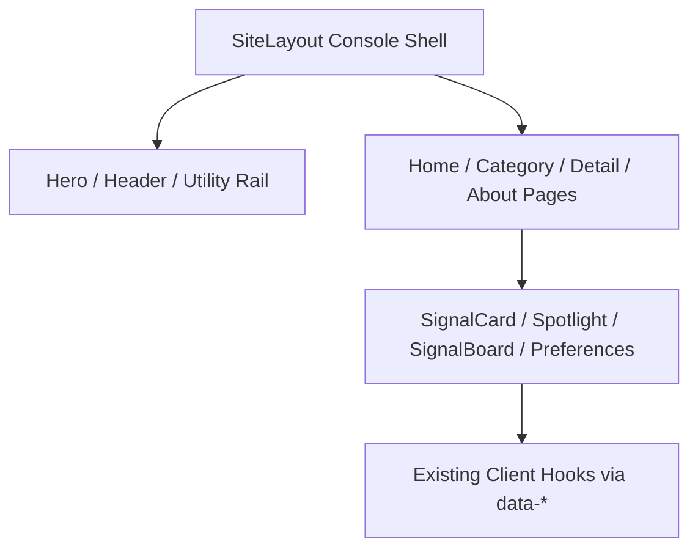

# 变更提案: sentinel-console-ui-rebuild

## 元信息

```yaml
类型: 重构/优化
方案类型: implementation
优先级: P0
状态: 已完成
创建: 2026-03-06
```

---

## 1. 需求

### 背景

`ACG Radar` 现有站点已经具备稳定的静态部署、双语页面、搜索与偏好能力，但视觉表达仍偏“功能型聚合站”。
当前主壳与核心页面存在几个明显问题：

- `src/layouts/SiteLayout.astro` 过重，壳层、导航、主题、设备检测、脚本入口耦合在一起。
- `src/pages/zh/*` 与 `src/pages/ja/*` 多个核心页面结构镜像复制，UI 重构成本高。
- `PostCard`、`SpotlightGrid`、`SignalBoard`、`PreferencesPanel` 已经具备“雷达 / 信号 / 聚光”语义，但视觉语言尚未充分放大。
- 整体视觉缺少“作品级展示站”的世界观与统一叙事，首页、列表、详情、关于页之间还没有形成强烈的一体化体验。

用户已明确要求：

- 做一次更激进的 UI 设计与前端重构；
- 完全放弃保守式微调；
- 保留 `Astro + GitHub Pages` 部署方式；
- 目标是“更接近作品级展示站”的统一视觉与交互体验。

### 目标

- 将整站升级为 **「哨兵信号台 Sentinel Console」** 风格：未来感控制台、信号中枢、深色玻璃与扫描层叠加的统一视觉系统。
- 重构首页、分类列表页、详情页、关于页，让它们共同服务于“ACG 信号控制台”的站点叙事。
- 拆出更清晰的 UI 壳层与页面结构，降低 `SiteLayout` 与双语镜像页面的维护复杂度。
- 在保留现有静态站优点的前提下，增强动效、节奏与信息层级，但仍坚持“静态可用、JS 渐进增强”。
- 让关键组件（卡片、聚光区、信号板、偏好面板）升级为统一的设计系统资产，而不是零散的页面拼装件。

### 约束条件

```yaml
时间约束: 当前任务一次性推进到可构建、可交付的完整 UI 重构版本
性能约束:
  - 保持 Astro 静态构建可通过
  - 避免引入重型前端框架或依赖 Canvas/WebGL 的实现
  - 动效对低性能设备可降级
兼容性约束:
  - 保留 Astro + GitHub Pages 部署方式
  - 保留现有双语站点路由结构（/zh/ 与 /ja/）
  - 保留现有搜索、主题、偏好、书签等主要交互入口的可用性
业务约束:
  - 不引入常驻后端
  - 不改变站点作为 ACG 内容聚合/浏览入口的核心定位
```

### 验收标准

- [ ] 首页、分类页、详情页、关于页完成统一的「哨兵信号台」视觉重构
- [ ] 全站形成清晰一致的 design tokens、壳层结构与组件语义
- [ ] PC 与移动端都具备明显升级后的视觉冲击力与可用性
- [ ] 现有核心交互入口仍可使用，且重构后构建通过
- [ ] 代码结构相较改造前更利于后续继续演进 UI

---

## 2. 方案

### 技术方案

采用 **「哨兵信号台 Sentinel Console」** 方向，对站点做一次以 UI 为核心的结构化重构：

1. **壳层重构**：围绕 `src/layouts/SiteLayout.astro` 重建全局舞台层、导航层、内容层和辅助控制层，确立控制台语义。
2. **设计系统重构**：升级 `src/styles/global.css`，建立新的颜色、材质、辉光、阴影、动效与间距 tokens，并统一卡片/面板/导航/阅读区语义。
3. **首页重构**：将首页从“功能聚合页”升级成主控制台，包括 hero 控制台、优先信号区、实时指标区、热门类别与信号流模块。
4. **列表与详情重构**：分类页转为“信号档案台”，详情页转为“档案解码界面”，强化信息层级、沉浸阅读和内容导流。
5. **组件语义升级**：重构 `PostCard`、`SpotlightGrid`、`SignalBoard`、`PreferencesPanel`，必要时抽出新的共享 section 组件，降低页面重复结构。
6. **双语镜像收敛**：尽量将中日文页面保持相同结构与风格协议，减少未来 UI 双份维护成本。

### 影响范围

```yaml
涉及模块:
  - src/layouts: 全局壳层与导航/页脚/舞台系统重构
  - src/pages/zh: 中文首页、分类页、详情页、关于页重构
  - src/pages/ja: 日文首页、分类页、详情页、关于页同步重构
  - src/components/organisms: PostCard / SpotlightGrid / SignalBoard / PreferencesPanel 等核心视觉组件升级
  - src/components: 共享 section/rail/header 类组件按需新增
  - src/styles: 全局 tokens、表面样式、动效与响应式规则重写
  - src/client: 仅做必要的 data-* 挂载兼容与渐进增强适配
  - helloagents/wiki: 更新 UI 架构与设计系统相关文档
预计变更文件: 18-30
```

### 风险评估

| 风险                                              | 等级 | 应对                                                         |
| ------------------------------------------------- | ---- | ------------------------------------------------------------ |
| 视觉过度炫技导致内容可读性下降                    | 高   | 以正文与信息可读性为主，动效只做外围增强                     |
| `SiteLayout` 与页面结构耦合较深，改动范围容易扩散 | 高   | 先重构壳层与共享 section，再推进页面改造                     |
| 双语镜像页面重构不一致                            | 中   | 以中文页为样板，同时同步日文页结构                           |
| 多层 glow/blur 造成低端设备掉帧                   | 中   | 使用轻量 CSS 动效并兼顾 reduced-motion / coarse-pointer 场景 |
| data-\* 与 `src/client/app.ts` 现有绑定失配       | 中   | 保留关键挂点名称，优先兼容现有行为后再收敛结构               |

---

## 3. 技术设计（可选）

### 架构设计



### 数据模型

| 字段            | 类型   | 说明                           |
| --------------- | ------ | ------------------------------ |
| view mode       | string | 网格/列表等视图状态            |
| density mode    | string | 紧凑/舒适密度                  |
| theme mode      | string | light/dark/auto                |
| signal emphasis | string | 卡片、hero、列表等不同视觉层级 |

---

## 4. 核心场景

### 场景: 控制台首页

**模块**: `src/pages/zh/index.astro`, `src/pages/ja/index.astro`
**条件**: 用户首次进入站点首页
**行为**: 展示主控制台 hero、信号指标、聚光内容、快速筛选与内容流
**结果**: 用户立即感知站点世界观，并能快速进入内容浏览

### 场景: 信号档案浏览

**模块**: `src/pages/*/c/[category].astro`, `PostCard`, `SpotlightGrid`
**条件**: 用户进入分类页或执行筛选
**行为**: 以更强层级的控制台档案视图查看内容并切换视图/密度
**结果**: 浏览更顺滑，分类与列表信息更有辨识度

### 场景: 档案解码阅读

**模块**: `src/pages/*/p/[id].astro`
**条件**: 用户进入详情页
**行为**: 阅读主内容、查看元信息、通过下一信号和相关推荐继续浏览
**结果**: 阅读体验沉浸，页面风格与首页/列表页保持统一

### 场景: 站点使命说明

**模块**: `src/pages/*/about.astro`
**条件**: 用户查看关于页
**行为**: 浏览站点定位、结构、来源与技术说明
**结果**: 关于页不再是普通说明页，而是控制台任务说明书

---

## 5. 技术决策

### sentinel-console-ui-rebuild#D001: 采用「哨兵信号台」作为全站重构方向

**日期**: 2026-03-06
**状态**: ✅采纳
**背景**: 用户要求激进 UI 重构，同时项目现有命名与信息结构天然带有 radar / signal / spotlight 语义。
**选项分析**:
| 选项 | 优点 | 缺点 |
|------|------|------|
| A: 哨兵信号台 | 与站点语义高度匹配；统一性强；适合静态站渐进增强 | 容易做成“过度仪表盘化” |
| B: 暗房分镜 | 版式高级感强；详情页阅读气质突出 | 与“Radar / Signal”核心叙事结合度略弱 |
| C: 霓虹航流 | 沉浸感与冲击力最强 | 性能与审美执行风险最高 |
**决策**: 选择方案 A
**理由**: 它最能放大 `ACG Radar` 的现有语义资产，同时兼顾作品级视觉、组件可复用性与技术可控性。
**影响**: 影响全站壳层、页面版式、设计系统与核心展示组件的实现方式。
