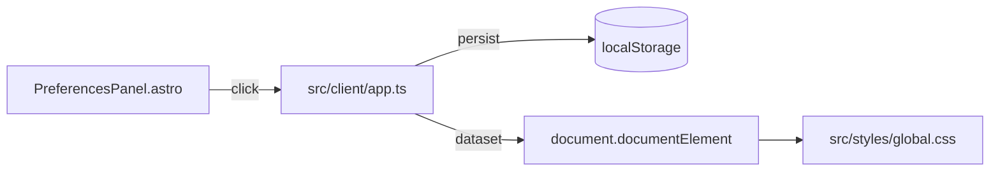

# 技术设计: Layout Modes & Client State Refactor

## 技术方案

### 核心技术
- Astro（静态站点输出）+ Tailwind CSS + 全局 CSS 变量系统
- 浏览器端交互：`src/client/app.ts` + 小模块（cmdk/fulltext/workers/utils）
- 本地状态：`localStorage`（偏好/已读/收藏/过滤）

### 实现要点
1. **新增偏好项（独立 key，避免迁移风险）**
   - `acg.view.v1`: `"grid" | "list"`
   - `acg.density.v1`: `"comfort" | "compact"`
2. **根节点 dataset 驱动样式**
   - `document.documentElement.dataset.acgView = "grid" | "list"`
   - `document.documentElement.dataset.acgDensity = "comfort" | "compact"`
3. **CSS 覆盖策略（最小侵入）**
   - 默认仍由 Tailwind class 控制布局
   - 当启用 list/compact 时，通过 `html[data-acg-view="list"] ...` / `html[data-acg-density="compact"] ...` 覆盖关键布局与展示密度
4. **客户端状态重构**
   - 抽离 `localStorage` 的安全读写/JSON parse/Set 序列化工具到 `src/client/state/storage.ts`
   - `app.ts` 仅保留“业务编排 + UI wiring”，降低重复 try/catch
5. **i18n 与 UI**
   - 在 `src/i18n/i18n.ts` 增加偏好项文案 key（中/日）
   - 在 `PreferencesPanel.astro` 增加两组 segmented controls（View/Density）

## 架构设计
本次变更不引入新运行时架构层级，保持“静态站点 + 浏览器端增强”的核心架构不变。

## 架构决策 ADR
### ADR-017: 视图/密度偏好采用独立存储 key（非 filters v3 扩展）
**上下文:** `filters.v1` 已承载多项筛选逻辑且存在版本演进，直接扩展会提高迁移风险与回滚成本；视图/密度属于表现层偏好，独立更安全。
**决策:** 新增 `acg.view.v1` 与 `acg.density.v1` 两个 key，默认值分别为 `grid` 与 `comfort`。
**理由:** 降低对现有筛选逻辑的侵入；迁移成本为 0；容错更简单。
**替代方案:** 把字段加入 `acg.filters.v1` 并升级 version → 拒绝原因: 迁移风险更高且与筛选语义耦合。
**影响:** `app.ts` 增加两段读取/写入逻辑；CSS 以 dataset 作为开关。

## 安全与性能
- **安全:**
  - 不新增外部数据写入；只读写 `localStorage`
  - 所有 `localStorage` 读取都做 try/catch 与 schema 容错，避免异常阻断页面交互
- **性能:**
  - 视图切换基于 CSS 覆盖，不引入大规模 DOM 重排脚本
  - 避免引入新依赖，确保 perf budget 不上升

## 测试与部署
- **测试:**
  - `npm test`（核心纯函数回归）
  - `npm run check`（Astro/TS 类型检查）
  - `npm run build`（静态构建）
  - `npm run budget`（体积预算门禁）
- **部署:** 不改变 CI workflow；代码合并后仍由 GitHub Actions 定时同步并部署

