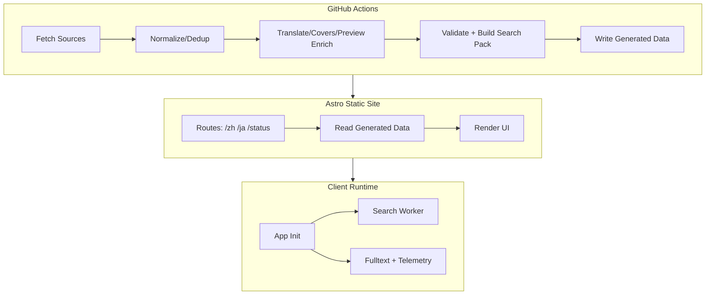

# 变更提案: acg-full-upgrade

## 元信息

```yaml
类型: 重构/优化
方案类型: implementation
优先级: P0
状态: 草稿
创建: 2026-01-27
目标版本: 0.6.x（稳定化）→ 1.0（里程碑）
```

---

## 1. 需求

### 背景

ACG Radar / ACGレーダー 是一个“无后端常驻”的 ACG 资讯雷达：由 GitHub Actions 每小时抓取/清洗数据，静态构建并部署到 GitHub Pages。

当前仓库工程成熟度较高（CI、Lighthouse、CodeQL、Dependabot、覆盖率门禁等均已落地），但也出现了典型的“功能增长后复杂度累积”问题：

- **可维护性风险**：存在超大文件，后续迭代和回归成本高。
  - `src/client/app.ts` 约 4900 行
  - `src/client/features/fulltext.ts` 约 3500 行
  - `scripts/sync.ts` 约 1200 行
- **外部依赖风险**：抓取/翻译/全文预览依赖第三方站点与代理服务，稳定性、合规性与可替换性需要更清晰的工程边界与兜底策略。
- **工程化“升级空间”**：现有质量门禁强，但模块拆分与领域边界还可进一步清晰化，从而让新增来源/修复站点结构变化/扩展 UI 能力更可预测。

本提案目标不是“重写”，而是以**增量拆分 + 回归门禁强化**为主线，完成一次面向 0.6.x 稳定化、并为 1.0 做准备的“全方位升级”。

### 目标

- **稳定性**：每小时同步与站点渲染保持稳定；来源波动时“可降级、可观测、可恢复”。
- **可维护性**：将超大文件拆分为清晰模块，使单文件规模和职责更可控（便于 review、定位与测试）。
- **可测试性**：把关键逻辑沉淀为纯函数与可测模块，降低“只能靠线上跑一轮”才能验证的风险。
- **性能与体验**：维持（或提升）LHCI/Perf Budget 表现；避免新增功能带来 JS/CSS 体积膨胀与交互掉帧。
- **安全与合规**：外部依赖（翻译/代理/抓取）的使用方式更加明确，可配置、可关闭、可替换。
- **发布可控**：形成可执行的里程碑与验收口径，为后续 1.0 发布打基础。

### 非目标（本次不做）

- 不引入常驻后端服务/数据库（保持“静态 + Actions”架构）
- 不做账号系统/登录/多端同步（收藏、已读等继续 localStorage 为主）
- 不默认引入需要密钥/付费的第三方服务（如商业翻译/观测平台）
- 不做“全面 UI 重做”（除非为修复性能/可用性回归所必需）

### 约束条件

```yaml
时间约束: 无硬性截止（以“每个里程碑可独立交付”为原则推进）
性能约束:
  - `npm run budget` 继续通过（dist 体积预算门禁）
  - Lighthouse CI 继续通过（.lighthouserc.json 断言为 error 级）
兼容性约束:
  - GitHub Pages 路由与 base path（`ACG_BASE`）保持兼容
  - 既有公开入口保持可用：`/zh/`、`/ja/`、`/status/`、`/feed.xml`、`/feed.json`、`/opml.xml`、`/robots.txt`、`/sitemap.xml`、`/.well-known/security.txt`
  - localStorage 的既有 key 尽量不改名（如需迁移必须提供向后兼容）
业务约束:
  - 保持“无后端常驻”的成本模型（默认不引入需要密钥/付费的服务）
  - 同步依然由 GitHub Actions 定时执行（每小时）
```

### 验收标准

- [ ] CI 全绿：`npm run lint`、`npm run format:check`、`npm run check`、`npm run test:coverage`、`npm run build`、`npm run budget`
- [ ] 定时流水线可用：`Hourly Sync & Deploy` 能稳定完成（同步 + validate + build + budget + deploy）
- [ ] LHCI 可用：`Lighthouse CI`（provided）与 `Lighthouse CI (Simulated)`（simulate）保持通过/不回退
- [ ] 关键模块完成拆分且行为不变：`src/client/app.ts`、`src/client/features/fulltext.ts`、`scripts/sync.ts`
- [ ] 关键风险点具备可配置兜底：翻译/全文预览/代理/抓取失败时可降级并在 status/telemetry 中可追踪

---

## 2. 方案

### 技术方案

总体策略：**先稳再快**。

1. **先稳（P0）**：把“最容易引发长期维护成本”的结构性问题解决掉：大文件拆分、职责边界明确、测试与门禁补齐。
2. **再快（P1/P2）**：在结构稳定后，再做体验/性能/功能级增强（不会被架构拖累）。

本方案将升级工作拆成 5 个可独立交付的里程碑（每个里程碑都以 CI/LHCI/Budget/validate 为验收门禁）：

- **M1 范围与基线（P0）**：确认目标版本与兼容策略；补齐基线记录与回归口径。
- **M2 客户端模块化（P0）**：拆分 `src/client/app.ts` 与 `src/client/features/fulltext.ts`，让浏览器端逻辑可维护、可测试。
- **M3 同步管线模块化（P0/P1）**：拆分 `scripts/sync.ts`，把“抓取/解析/清洗/去重/翻译/补图/产物生成”变成可组合步骤。
- **M4 稳定性与可观测性（P1）**：对外部依赖引入 provider/开关与更清晰的降级策略；增强 status 与日志的可诊断性。
- **M5 CI/CD 与文档发布（P1/P2）**：对齐 Node 版本策略；完善贡献者文档与发布流程，形成长期可持续的维护节奏。

### 影响范围

```yaml
涉及模块:
  - scripts: 同步管线拆分、外部依赖抽象、稳定性与日志增强
  - src/client: 浏览器端入口/全文预览/命令面板等模块化拆分与回归测试
  - src/lib: 数据结构与共享工具（必要时补齐类型与不变量）
  - tests: 覆盖率与关键逻辑用例补齐（确保门禁可持续）
  - .github/workflows: 如需对齐 Node 版本与流程门禁，会有小幅调整
  - docs/ & helloagents/wiki: 文档同步更新（以代码为准）
预计变更文件: 40-80（以重构拆分为主，尽量避免行为改动）
```

### 风险评估

| 风险                                                     | 等级 | 应对                                                                                              |
| -------------------------------------------------------- | ---- | ------------------------------------------------------------------------------------------------- |
| 大文件拆分引入回归（行为变化/边界遗漏）                  | 高   | “薄入口 + 内部模块拆分”策略；每次拆分都以 `npm run test:coverage` + `npm run check` + LHCI 为门禁 |
| 抓取/翻译/全文预览依赖第三方，出现 451/403/限流/结构变化 | 高   | provider/开关 + cache + 重试/退避 + status 可观测；对高风险来源做更保守策略                       |
| CI 门禁过严导致迭代阻塞（尤其 LHCI=100）                 | 中   | 在不降低门禁前提下：通过拆分与按需加载减少体积/长任务；必要时先做“基线修复”再推进功能             |
| 同步产物体积增加导致 Pages 部署慢或超预算                | 中   | 预算门禁前置；对数据/封面缓存做分层与上限；必要时引入更强 gzip 或分片策略                         |
| 翻译接口（gtx）稳定性/合规性不确定                       | 中   | 保持默认行为不变，但抽象 provider；提供 `none` 模式与显式开启策略，降低风险暴露面                 |

---

## 3. 技术设计（可选）

> 涉及架构变更、API设计、数据模型变更时填写

### 架构设计



### 模块拆分建议（落地时可微调）

- `src/client/app.ts` → 入口保持不变，内部拆分为：
  - `src/client/init/*`：启动、事件绑定、全局降级（scroll/perf/device）
  - `src/client/features/*`：cmdk/fulltext/telemetry 等功能域
  - `src/client/utils/*`：纯函数与可测工具（可移到 `src/lib` 的也逐步迁移）
- `src/client/features/fulltext.ts` → 拆为 `src/client/features/fulltext/*`：
  - `fetch/*`：Jina/AllOrigins/HTML 抽取策略与 provider
  - `parse/*`：HTML → Markdown/blocks 的处理（可测）
  - `render/*`：DOM 注入与渐进渲染（低性能降级）
  - `cache/*`：localStorage 缓存与版本迁移
- `scripts/sync.ts` → 拆为 `scripts/pipeline/*`：
  - `fetch`、`parse`、`normalize`、`dedup`、`translate`、`enrich`、`status`、`outputs`

---

## 4. 核心场景

> 执行完成后同步到对应模块文档

### 场景: 每小时同步 → 站点更新（核心主链路）

**模块**: `scripts/*` + `src/lib/generated-data.ts` + `src/pages/*`  
**条件**: GitHub Actions schedule 触发；来源可访问性不稳定  
**行为**: 抓取 → 清洗/去重 →（可选）翻译/补图 → 写入 `src/data/generated/*` → build → deploy  
**结果**: `/zh/` 与 `/ja/` 信息流更新；`/status/` 能展示本轮同步质量与失败来源

### 场景: 用户打开详情页 → 全文预览（高复杂度、易波动）

**模块**: `src/client/features/fulltext*`  
**条件**: 外部站点可能 451/403/结构变化；设备可能低性能  
**行为**: 尝试阅读模式/HTML 抽取；必要时降级；本地缓存并提供切换；失败可恢复与提示  
**结果**: 用户能稳定阅读，且异常不会拖垮列表体验；错误在 telemetry/status 中可追踪

### 场景: 可观测性与隐私（默认本地、可选上报）

**模块**: `src/client/utils/telemetry.ts` + `src/client/utils/monitoring.ts`  
**条件**: 用户未开启上报；或配置 endpoint 且显式开启 upload  
**行为**: 默认仅 localStorage 记录；启用后 pagehide 尝试 sendBeacon/fetch keepalive 上报  
**结果**: 兼顾隐私与排障；对外部 endpoint 的失败不影响站点功能

---

## 5. 技术决策

> 本方案涉及的技术决策，归档后成为决策的唯一完整记录

### acg-full-upgrade#D001: 保持“无后端常驻”的整体架构

**日期**: 2026-01-27
**状态**: ✅采纳
**背景**: 当前系统的核心优势是低运维、低成本与可持续运行；升级不应破坏这一点。
**选项分析**:
| 选项 | 优点 | 缺点 |
|------|------|------|
| A: 引入常驻后端/数据库 | 可做更强个性化、实时推送 | 运维与成本上升；引入新攻击面与长期维护负担 |
| B: 维持静态 + Actions 同步 | 成本可控、结构简单、长期可跑 | 依赖外部来源稳定性；功能扩展需要更“工程化” |
**决策**: 选择方案 B
**理由**: 符合项目定位与当前工程投入模型；对升级目标（稳定/可维护/可测试）无负面影响。
**影响**: 全局（CI/CD、数据管线、前端交互的所有设计都以“静态产物”为前提）

### acg-full-upgrade#D002: 采用“增量拆分（薄入口）”而非 Big-Bang 重写

**日期**: 2026-01-27  
**状态**: ✅采纳  
**背景**: 超大文件需要治理，但一次性重写会放大回归风险，且难以在严格门禁下推进。  
**选项分析**:
| 选项 | 优点 | 缺点 |
|------|------|------|
| A: Big-Bang 重写 | 结构最自由、一次到位 | 回归风险极高；调试周期长；难以分阶段交付 |
| B: 薄入口 + 内部模块拆分 | 每步可验收；风险可控；可逐步提升测试 | 需要更强的模块边界设计与迁移纪律 |
**决策**: 选择方案 B  
**理由**: 与“先稳再快”策略一致；更适合在现有 CI/LHCI/Budget 门禁下持续推进。  
**影响**: `src/client/*`、`scripts/*` 的重构方式与目录结构调整策略

### acg-full-upgrade#D003: 外部依赖做 Provider 抽象，并提供显式开关

**日期**: 2026-01-27  
**状态**: ✅采纳  
**背景**: 翻译（gtx）、全文预览代理（Jina/AllOrigins）具备不可控波动，需要“可替换、可禁用、可降级”。  
**选项分析**:
| 选项 | 优点 | 缺点 |
|------|------|------|
| A: 继续硬编码单一路径 | 实现简单 | 风险集中；不可替换；线上波动时排障困难 |
| B: Provider 抽象 + 默认保持现状 | 风险可控；可扩展；可在 CI/本地切换 | 需要更多接口设计与测试 |
**决策**: 选择方案 B  
**理由**: 在不改变默认行为的前提下提升系统韧性，且为未来扩展预留空间。  
**影响**: `scripts/lib/translate.ts`、全文预览 fetchers、相关 env 变量与文档
