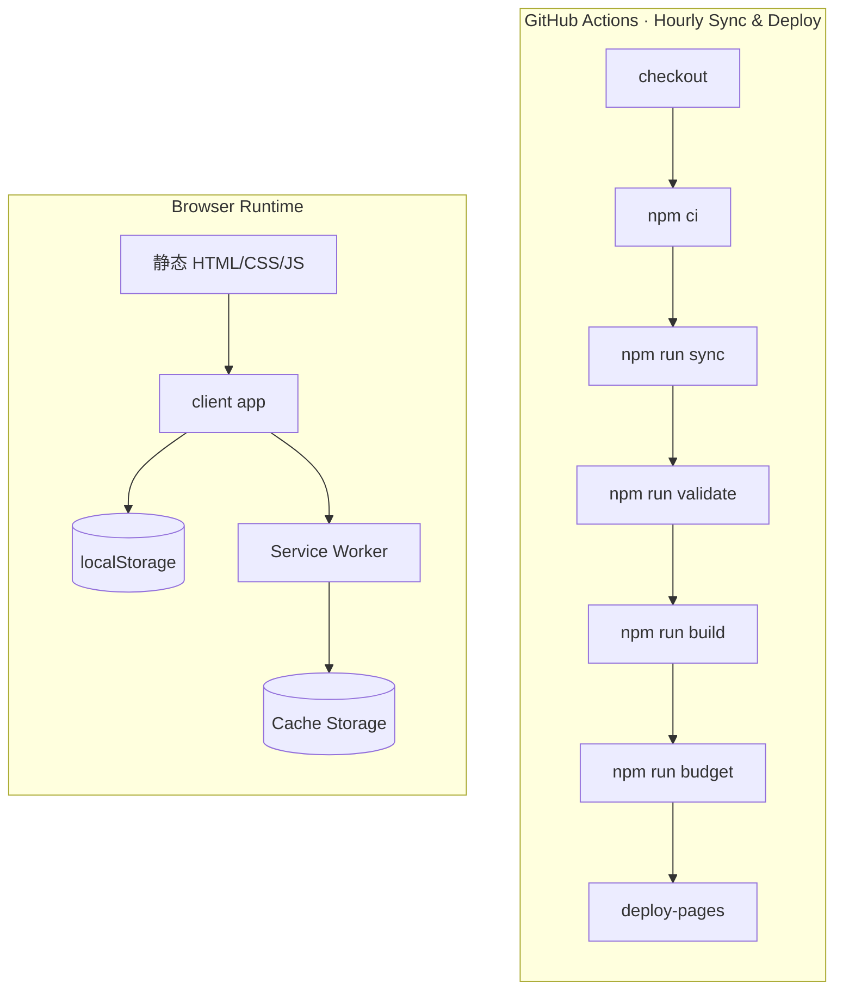
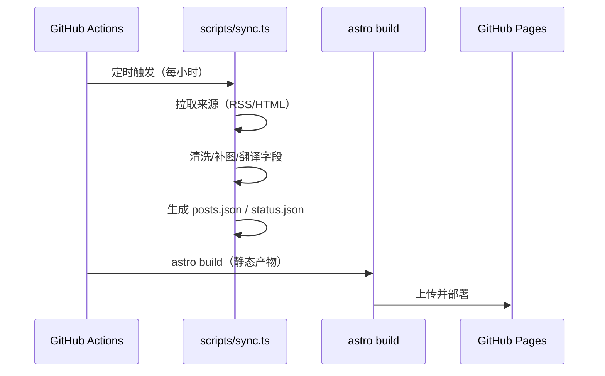

# 架构设计

## 总体架构

## 技术栈
- 构建/站点：Astro（静态输出）+ Vite
- 样式：Tailwind + 自定义 CSS 变量（主题/玻璃拟态）
- 数据：同步阶段生成 `public/data/*.json(.gz)` 与 `src/data/generated/*.json`（均不提交）
- 部署：GitHub Pages

## 核心流程

## 质量门禁（CI）

- `npm run validate`：校验同步产物结构与关键不变量
- `npm run budget`：校验 `dist/` 产物体积预算（指标按“入口页 vs 数据载荷”拆分）
  - `html/xml/json(core)`：入口页与核心 endpoint（排除 `/p/<id>/index.html` 详情页；不计入 `dist/data/*.json`）
  - `data.json`：`dist/data/*.json`（默认仅观测；可用 `ACG_BUDGET_DATA_JSON_KB` 启用门禁）
  - `data.gz`：`dist/data/*.json.gz`（门禁指标，反映网络与缓存成本）

## 重大架构决策

| adr_id | title | date | status | affected_modules | details |
|--------|-------|------|--------|------------------|---------|
| ADR-001 | 来源配置改为单一事实来源（SSOT） | 2025-12-25 | ✅已采纳 | pipeline-sync / web-ui / shared-lib | history/2025-12/202512252117_evolution_v0_2/how.md |
| ADR-002 | 增加 OPML 与 JSON Feed 订阅导出 | 2025-12-25 | ✅已采纳 | web-ui / shared-lib | history/2025-12/202512252117_evolution_v0_2/how.md |
| ADR-003 | 引入 PWA 基础（Manifest + SW） | 2025-12-25 | ✅已采纳 | web-ui / client-app | history/2025-12/202512252117_evolution_v0_2/how.md |
| ADR-004 | CI 增加数据校验与体积预算门禁 | 2025-12-25 | ✅已采纳 | pipeline-sync | history/2025-12/202512252117_evolution_v0_2/how.md |
| ADR-005 | Perf Budget 指标按“入口页 vs 数据载荷”拆分 | 2025-12-31 | ✅已采纳 | pipeline-sync | history/2025-12/202512312048_evolution_v0_7_budget_data_split/how.md |
| ADR-006 | 全文预览采用“渲染快速可见 + idle 后处理”的分阶段策略 | 2026-01-02 | ✅已采纳 | client-app | history/2026-01/202601021014_evolution_v0_9_fulltext_perf_pipeline/how.md |
| ADR-007 | 同步管线的 HTML 来源解析采用注册表（插件式） | 2026-01-02 | ✅已采纳 | pipeline-sync | history/2026-01/202601021014_evolution_v0_9_fulltext_perf_pipeline/how.md |
| ADR-008 | URL 规范化剥离常见追踪参数 | 2026-01-02 | ✅已采纳 | pipeline-sync / shared-lib | history/2026-01/202601021014_evolution_v0_9_fulltext_perf_pipeline/how.md |
| ADR-009 | 抓取请求增加保守重试与 jitter 退避 | 2026-01-02 | ✅已采纳 | pipeline-sync | history/2026-01/202601021014_evolution_v0_9_fulltext_perf_pipeline/how.md |
| ADR-010 | 全文预览渲染/翻译迁移到 Web Worker | 2026-01-02 | ✅已采纳 | client-app | history/2026-01/202601021845_evolution_v0_10_fulltext_worker/how.md |
| ADR-011 | status.json 增强可观测性字段（重试/解析统计） | 2026-01-02 | ✅已采纳 | pipeline-sync / web-ui | history/2026-01/202601022104_evolution_v0_11_status_observability/how.md |
| ADR-012 | 全文预览 DOM 注入升级为“blocks 渐进追加” | 2026-01-02 | ✅已采纳 | client-app | history/2026-01/202601022255_evolution_v0_12_fulltext_progressive_dom/how.md |
| ADR-013 | status.json 引入趋势字段（连续失败/增量/最新发布时间） | 2026-01-03 | ✅已采纳 | pipeline-sync / web-ui | history/2026-01/202601030108_evolution_v0_13_status_health_trend/how.md |
| ADR-014 | 同步翻译引入来源 lang + 抓取异常缩水回退（parse_drop） | 2026-01-03 | ✅已采纳 | pipeline-sync / web-ui / shared-lib | history/2026-01/202601030220_evolution_v0_14_translation_lang_and_parse_drop/how.md |
| ADR-015 | PWA 离线：SW data 请求按类型兜底 + 离线状态可感知 | 2026-01-03 | ✅已采纳 | pwa / client-app | history/2026-01/202601030318_evolution_v0_15_pwa_offline_data_fallback/how.md |
| ADR-016 | status-history 趋势数据采用“回读上一轮 + 追加裁剪” | 2026-01-02 | ✅已采纳 | pipeline-sync / web-ui | history/2026-01/202601030352_evolution_v0_16_status_history_searchpack_v2_sources/how.md |
| ADR-017 | 视图/密度偏好采用独立存储 key（View/Density） | 2026-01-11 | ✅已采纳 | web-ui / client-app | history/2026-01/202601112152_evolution_v0_3_layout_modes/how.md |

