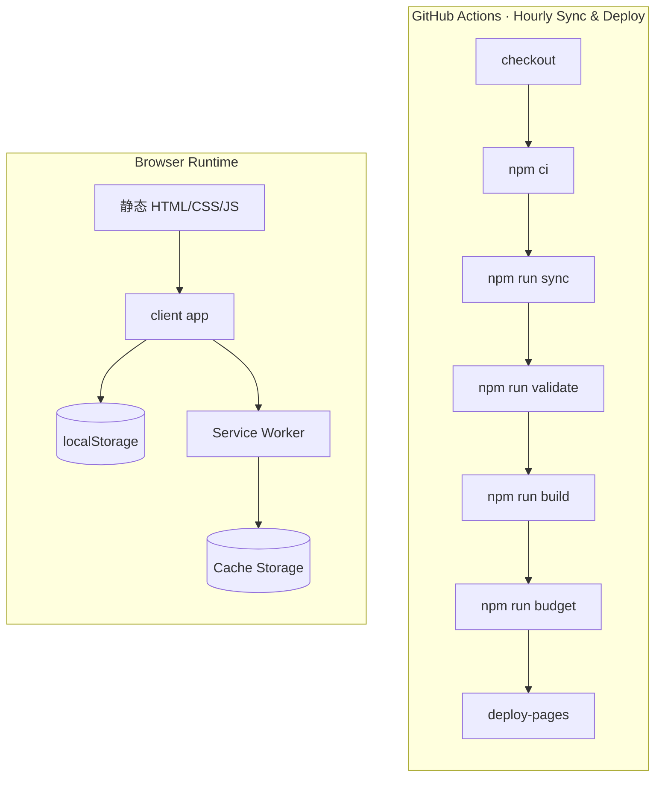
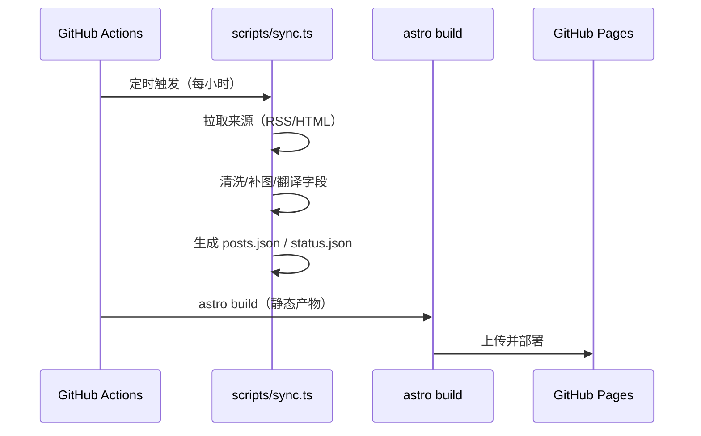

# 架构设计

## 总体架构

## 技术栈
- 构建/站点：Astro（静态输出）+ Vite
- 样式：Tailwind + 自定义 CSS 变量（主题/玻璃拟态）
- 数据：同步阶段生成 `public/data/*.json(.gz)` 与 `src/data/generated/*.json`（均不提交）
- 部署：GitHub Pages

## 核心流程

## 重大架构决策

| adr_id | title | date | status | affected_modules | details |
|--------|-------|------|--------|------------------|---------|
| ADR-001 | 来源配置改为单一事实来源（SSOT） | 2025-12-25 | ✅已采纳 | pipeline-sync / web-ui / shared-lib | history/2025-12/202512252117_evolution_v0_2/how.md |
| ADR-002 | 增加 OPML 与 JSON Feed 订阅导出 | 2025-12-25 | ✅已采纳 | web-ui / shared-lib | history/2025-12/202512252117_evolution_v0_2/how.md |
| ADR-003 | 引入 PWA 基础（Manifest + SW） | 2025-12-25 | ✅已采纳 | web-ui / client-app | history/2025-12/202512252117_evolution_v0_2/how.md |
| ADR-004 | CI 增加数据校验与体积预算门禁 | 2025-12-25 | ✅已采纳 | pipeline-sync | history/2025-12/202512252117_evolution_v0_2/how.md |

